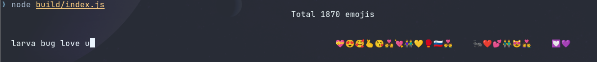

#### You rarely use Emoji, but when you need to pick someone, you don't know where to find a simple :bug: (🐛) ones. This simple one is for u 💜💜💜💜

## Installation
- Wait util I write action script. Now I need to __sleep__.
- Or clone this repo, install node_modules and run `node build.mjs`. And run with `node build/index.js`
- Good `night`

